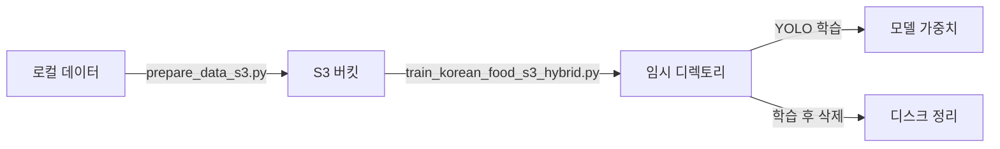

# S3 기반 YOLO 학습 가이드

서버에 데이터를 저장하지 않고 S3에서 실시간으로 스트리밍하여 학습하는 방법입니다.

## 📋 목차

1. [개요](#개요)
2. [설치](#설치)
3. [S3 설정](#s3-설정)
4. [사용 방법](#사용-방법)
5. [파일 구조](#파일-구조)
6. [문제 해결](#문제-해결)

---

## 🎯 개요

이 프로젝트는 대용량 이미지 데이터셋을 로컬 서버에 저장하지 않고 AWS S3에서 직접 스트리밍하여 YOLO 모델을 학습시키는 솔루션입니다.

### 장점

- ✅ **디스크 절약**: 서버 디스크에 데이터를 저장하지 않음
- ✅ **확장성**: S3의 무제한 스토리지 활용
- ✅ **관리 편의성**: 중앙화된 데이터 관리
- ✅ **비용 효율**: 필요할 때만 데이터 전송

### 지원하는 학습 방식

1. **하이브리드 방식** (추천): 임시 디렉토리에 배치 단위로 다운로드 후 학습
2. **순수 스트리밍 방식**: PyTorch 커스텀 DataLoader 사용

---

## 🔧 설치

### 1. 의존성 설치

```bash
pip install -r requirements.txt
```

주요 패키지:

- `boto3`: AWS S3 SDK
- `ultralytics`: YOLO 모델
- `torch`, `torchvision`: PyTorch
- `python-decouple`: 환경 변수 관리

### 2. AWS 설정

AWS 자격증명 방법 (둘 중 하나):

**방법 A: 환경 변수 사용** (추천)

```bash
# .env 파일 생성
cp .env.example .env

# .env 파일 편집
nano .env
```

**방법 B: AWS CLI 설정**

```bash
aws configure
```

---

## ⚙️ S3 설정

### 1. .env 파일 설정

`.env.example` 파일을 `.env`로 복사하고 실제 값으로 수정:

```env
# AWS S3 설정
AWS_ACCESS_KEY_ID=your_access_key_here
AWS_SECRET_ACCESS_KEY=your_secret_key_here
AWS_REGION=ap-northeast-2

# S3 버킷 정보
S3_BUCKET_NAME=your-bucket-name
S3_TRAIN_PREFIX=train/
S3_VAL_PREFIX=val/

# 캐시 설정
IMAGE_CACHE_SIZE=100
```

### 2. S3 버킷 구조

데이터는 다음과 같은 구조로 S3에 업로드되어야 합니다:

```
s3://your-bucket-name/
├── train/
│   ├── 김치찌개/
│   │   ├── 001.jpg
│   │   ├── 002.jpg
│   │   └── ...
│   ├── 비빔밥/
│   │   ├── 001.jpg
│   │   └── ...
│   └── ...
└── val/
    ├── 김치찌개/
    │   ├── 001.jpg
    │   └── ...
    └── ...
```

---

## 🚀 사용 방법

### 단계 1: 로컬 데이터를 S3에 업로드

기존에 로컬에 데이터가 있다면, S3에 업로드합니다:

```bash
python prepares/prepare_data_s3.py
```

이 스크립트는:

- 로컬의 `D:\lck_data\dataset\kfood-yolo` 데이터를 읽음
- S3 버킷에 업로드 (train/, val/ 구조 유지)
- 진행률 표시 (tqdm 사용)

### 단계 2: S3 연결 테스트

```bash
python -c "from utils.s3_loader import test_s3_connection; test_s3_connection('your-bucket-name', 'train/')"
```

또는 Python에서:

```python
from utils.s3_loader import test_s3_connection

test_s3_connection(
    bucket_name='your-bucket-name',
    prefix='train/'
)
```

### 단계 3: 학습 실행

#### 방법 1: 하이브리드 방식 (추천)

```bash
python train_korean_food_s3_hybrid.py
```

**특징:**

- S3에서 임시 디렉토리로 다운로드
- YOLO 기본 학습 사용 가능
- 학습 후 임시 파일 자동 삭제
- 안정적이고 빠름

#### 방법 2: 순수 스트리밍 방식

```bash
python train_korean_food_s3.py
```

**특징:**

- 서버에 데이터를 전혀 저장하지 않음
- 메모리 캐싱 사용
- 커스텀 PyTorch DataLoader 필요

---

## 📁 파일 구조

```
utr-test/
├── config/
│   ├── __init__.py
│   └── s3_config.py              # S3 설정 관리
├── utils/
│   ├── __init__.py
│   ├── s3_loader.py              # S3 이미지 로더
│   └── s3_dataset.py             # PyTorch 커스텀 Dataset
├── prepares/
│   ├── prepare_data.py           # 로컬 데이터 준비 (기존)
│   └── prepare_data_s3.py        # S3에 데이터 업로드
├── train_korean_food.py          # 로컬 학습 (기존)
├── train_korean_food_s3.py       # S3 순수 스트리밍 학습
├── train_korean_food_s3_hybrid.py # S3 하이브리드 학습 (추천)
├── .env.example                  # 환경 변수 예시
├── requirements.txt              # 의존성
└── S3_TRAINING_GUIDE.md          # 이 파일
```

---

## 🔍 주요 클래스 및 함수

### S3ImageLoader

S3에서 이미지를 스트리밍으로 로드하는 클래스:

```python
from utils.s3_loader import S3ImageLoader

loader = S3ImageLoader(
    bucket_name='my-bucket',
    aws_access_key='...',  # 선택사항
    aws_secret_key='...',  # 선택사항
    region_name='ap-northeast-2'
)

# 이미지 로드
image = loader.load_image_from_s3('train/김치찌개/001.jpg')

# 클래스 구조 분석
structure = loader.get_class_structure('train/')
```

### S3ClassificationDataset

PyTorch Dataset 구현:

```python
from utils.s3_dataset import S3ClassificationDataset
from torchvision import transforms

transform = transforms.Compose([
    transforms.Resize((224, 224)),
    transforms.ToTensor()
])

dataset = S3ClassificationDataset(
    bucket_name='my-bucket',
    prefix='train/',
    transform=transform,
    cache_size=100
)

# DataLoader와 함께 사용
from torch.utils.data import DataLoader

loader = DataLoader(dataset, batch_size=16, shuffle=True)
```

### S3YOLOClassificationDataset

YOLO 학습을 위한 데이터셋 매니저:

```python
from utils.s3_dataset import S3YOLOClassificationDataset

manager = S3YOLOClassificationDataset(
    bucket_name='my-bucket',
    train_prefix='train/',
    val_prefix='val/'
)

# 정보 조회
info = manager.get_info()
print(f"클래스 수: {info['num_classes']}")
print(f"학습 샘플: {info['train_count']}")

# 데이터셋 생성
train_dataset = manager.create_train_dataset(transform=transform)
val_dataset = manager.create_val_dataset(transform=transform)
```

---

## 🐛 문제 해결

### 1. AWS 자격증명 오류

```
NoCredentialsError: Unable to locate credentials
```

**해결:**

- `.env` 파일이 있는지 확인
- `AWS_ACCESS_KEY_ID`, `AWS_SECRET_ACCESS_KEY` 값 확인
- AWS CLI 설정 확인: `aws configure list`

### 2. 버킷 접근 권한 오류

```
ClientError: An error occurred (403) when calling the HeadBucket operation: Forbidden
```

**해결:**

- S3 버킷 이름이 정확한지 확인
- IAM 정책에서 S3 읽기 권한 확인
- 버킷이 다른 리전에 있는지 확인

필요한 IAM 권한:

```json
{
  "Version": "2012-10-17",
  "Statement": [
    {
      "Effect": "Allow",
      "Action": ["s3:GetObject", "s3:ListBucket"],
      "Resource": [
        "arn:aws:s3:::your-bucket-name",
        "arn:aws:s3:::your-bucket-name/*"
      ]
    }
  ]
}
```

### 3. GPU 메모리 부족

```
RuntimeError: CUDA out of memory
```

**해결:**

- `BATCH_SIZE`를 줄이기 (4 → 2)
- `IMG_SIZE`를 줄이기 (224 → 128)
- `IMAGE_CACHE_SIZE`를 줄이기 (100 → 50)

### 4. 느린 다운로드 속도

**해결:**

- S3 Transfer Acceleration 활성화
- 올바른 리전 사용 (가까운 리전)
- `cache_size` 증가 (메모리가 충분하다면)

### 5. 임시 파일 삭제 실패 (Windows)

```
PermissionError: [WinError 32] The process cannot access the file...
```

**해결:**

- 프로세스가 완전히 종료될 때까지 대기
- 수동으로 임시 디렉토리 삭제 (로그에 경로 표시됨)

---

## ⚡ 성능 최적화 팁

### 1. 캐시 크기 조정

메모리가 충분하다면 캐시 크기를 늘리세요:

```env
IMAGE_CACHE_SIZE=500
```

### 2. 멀티 워커 조정

```python
DataLoader(..., num_workers=8)  # CPU 코어 수에 맞게
```

### 3. Prefetch

```python
DataLoader(..., prefetch_factor=2)
```

### 4. S3 Transfer Acceleration

AWS 콘솔에서 버킷 속성 → Transfer Acceleration 활성화

---

## 📊 비용 고려사항

### S3 비용 구성

1. **스토리지 비용**: 월 $0.023/GB (서울 리전, Standard)
2. **데이터 전송 비용**:
   - 업로드: 무료
   - 다운로드: $0.09/GB (첫 10TB)
3. **요청 비용**: GET 요청 $0.0004/1000건

### 예시 계산

- 데이터셋: 10GB, 150개 클래스, 100,000장 이미지
- 5 에포크 학습

**비용:**

- 스토리지: $0.23/월
- 전송 (5 에포크 × 10GB): $4.5
- 요청 (5 × 100,000 GET): $0.2
- **총합: 약 $5**

---

## 🔄 워크플로우 요약



---

## 📞 지원

문제가 있거나 질문이 있으면:

1. 로그 파일 확인
2. `.env` 설정 재확인
3. AWS 자격증명 및 권한 확인
4. S3 버킷 구조 확인

---

## 📝 라이센스

이 프로젝트는 교육 및 연구 목적으로 제공됩니다.

---

**마지막 업데이트**: 2025-11-11
